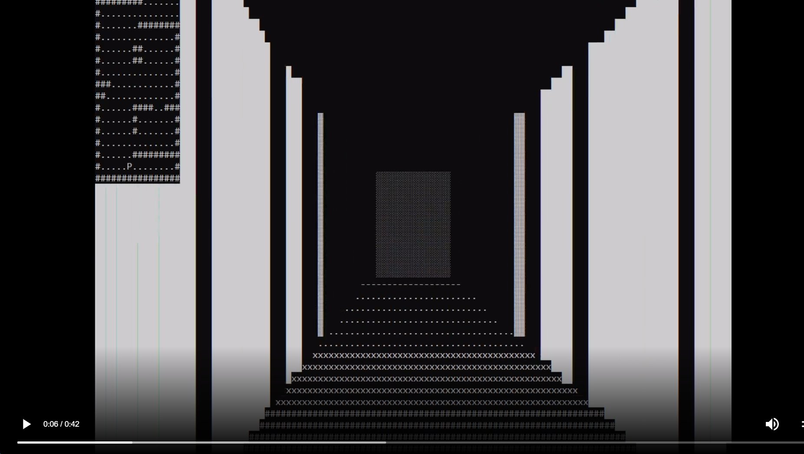
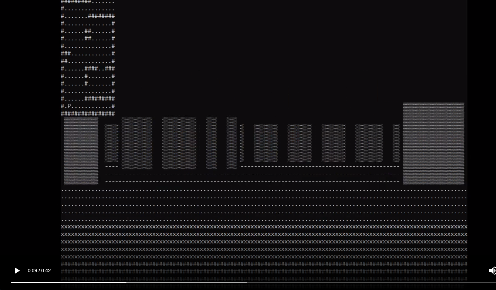

# Cmd Engine
 

# Introduction
 
There exist many algorithms that have been designed and developed over the years to accomplish goals. Here I display several algorithms written in the python programming language that pertain to 3d graphics. The primary method for creating this virtual space is through a process called Ray-Casting, a process of shooting out columns of rays into 2d space and producing the illusion of 3d space through a measure of distance and angle.
 
## Usage
 
Users can clone the repo and run files in the versions folder to test the engine. Since the cmd engine’s creation, several optimizations have been made in both the performance and visual appeal space.

Example Images:






 
## Algorithms used
 
This project primarily uses the Ray-Casting algorithm to produce 3d graphics in the CMD. This algorithm was inspired by both the Wolfenstein 3D game and this project was inspired by youtuber javidx9 who wrote these algorithms in C++.
 
```python
while bHitWall == False and fDistanceToWall < fDepth:

            fDistanceToWall += fStepSize
            nTestX = int(fPlayerX + fEyeX * fDistanceToWall)
            nTestY = int(fPlayerY + fEyeY * fDistanceToWall)

            # Test if ray is out of bounds
            if nTestX < 0 or nTestX >= nMapWidth or nTestY < 0 or nTestY >= nMapHeight:

                bHitWall = True         # Just set distance to maximum depth
                fDistanceToWall = fDepth

            else:

                # Ray is inbounds so test to see if the ray cell is a wall block
                if map[nTestY][nTestX] == '#':

                    # Ray has hit wall
                    bHitWall = True

                    # To highlight tile boundaries, cast a ray from each corner
                    # of the tile, to the player. The more coincident this ray
                    # is to the rendering ray, the closer we are to a tile 
                    # boundary, which we'll shade to add detail to the walls
                    p = []

                    # Test each corner of hit tile, storing the distance from
				    # the player, and the calculated dot product of the two rays
                    for tx in range(0,2):
                        for ty in range(0,2):

                            # Angle of corner to eye
                            vy = float(nTestY) + ty - fPlayerY
                            vx = float(nTestX) + tx - fPlayerX
                            d = sqrt(vx*vx + vy*vy)
                            dot = (fEyeX * vx / d) + (fEyeY * vy / d)
                            p.append((d, dot))
                    
                    # Sort Pairs from closest to farthest
                    p.sort(key=lambda x: x[0])

                    # First two/three are closest (we will never see all four)
                    fBound = 0.01
                    if math.acos(p[0][1]) < fBound: bBoundary = True
                    if math.acos(p[1][1]) < fBound: bBoundary = True
                    if math.acos(p[2][1]) < fBound: bBoundary = True
```
 
## License
[MIT](https://choosealicense.com/licenses/mit/)
 


